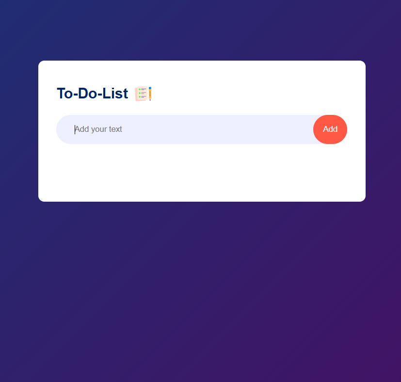
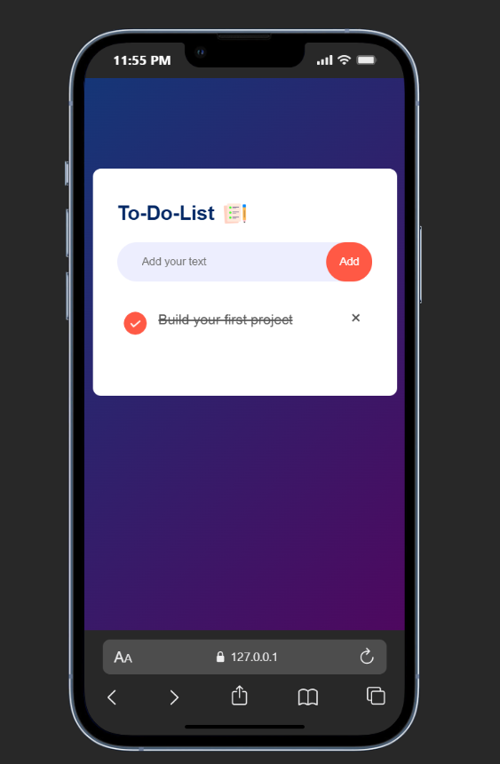

# To-Do List App (HTML • CSS • JavaScript)

Simple, clean, and local-storage powered to-do list — built with plain HTML/CSS/JS.  
Add tasks, edit, remove, mark complete, filter them, and everything persists in `localStorage`.  
Perfect for portfolio or quick practice.🙌

## 🔥 Features
- Add new tasks (title + optional description)
- Remove single tasks
- Mark tasks **Complete / Incomplete**
- Filter / browse tasks: **All / Active / Completed**
- Clear all completed tasks
- Persistent storage using `localStorage` (data stays after refresh)

## 🖼️ Screenshots

